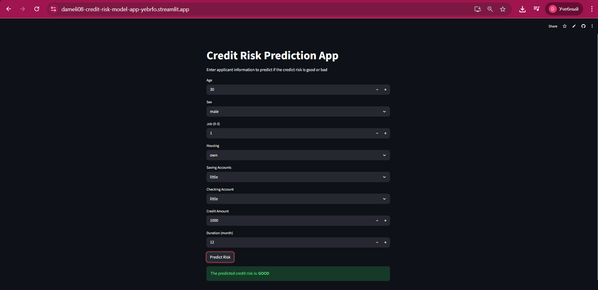

# 🔍 Credit Risk Prediction App

This is project is a machine learning–powered web application designed to predict whether a credit applicant represents a **good** or **bad** credit risk. The model is trained on structured financial and demographic data and deployed using **Streamlit** for interactive user input and real-time predictions.

---

### 🌐 Live Demo

👉 **Try the app here:**  
https://dameli08-credit-risk-model-app-yebrfo.streamlit.app/

---

## 📌 Features

- 🧠 Machine learning–based credit risk classifier  
- 🏦 Encoded categorical features (sex, housing status, saving/checking accounts)  
- 📊 User-friendly input interface via Streamlit  
- ⚡ Instant prediction result: **GOOD** or **BAD** credit risk  
- 📁 Model persistence using `joblib`

---

## 🧠 Model & Approach

- **Algorithm used:** Extra Trees Classifier  
- **Encoders:** Label encoders trained on categorical columns  
- **Prediction logic:** The model analyzes financial and demographic information and outputs a binary creditworthiness rating.

Model and encoder files included:
extra_trees_credit_model.pkl
Sex_encoder.pkl
Housing_encoder.pkl
Saving accounts_encoder.pkl
Checking account_encoder.pkl


---

## 🛠️ Technologies Used

| Category                    | Tools |
|-----------------------------|-------|
| Language                    | Python |
| Model & Processing          | Pandas, Scikit-learn, Joblib |
| Web Framework               | Streamlit |
| Deployment                  | Streamlit Cloud |

---

## 🚀 Getting Started (Local Setup)

To run the project locally:


### 1️⃣ Clone the repository

```bash
git clone <your-repo-url>
cd <your-repo-folder>

```


### 2️⃣ Create and activate a virtual environment
```
python -m venv venv
source venv/bin/activate   # Mac/Linux
venv\Scripts\activate      # Windows
```


### 3️⃣ Install dependencies
```
pip install -r requirements.txt
```


### 4️⃣ Run the application
```
streamlit run app.py
```


🎯 How It Works

User enters applicant information into the interface.

Inputs are encoded using pre-trained encoders.

The processed data is passed to the trained model.

The model outputs a prediction:

✅ GOOD → Low-risk client

❌ BAD → High-risk client


📷 App Preview


